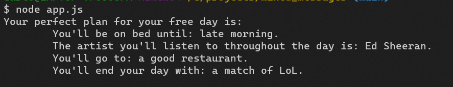

# Mixed Messages

This is a random message generator, everytime a user runs the program a random message will be shown.

The topic of the message is: Your perfect plan for your free day.

## General Information.

This is a project for the Codecademy's Full-Stack Engineer Career Path.

## Technologies Used.

- JavaScript - (ES6).
- Node.js - 14.17.5

## Screenshots.



## Setup.

Since this program does not have a HTML file, you'll need to download node.js to run it locally.

- [Download Node.js](https://nodejs.org/es/download/)
- Run the program with node in your terminal:

```
$ node app.js
```
